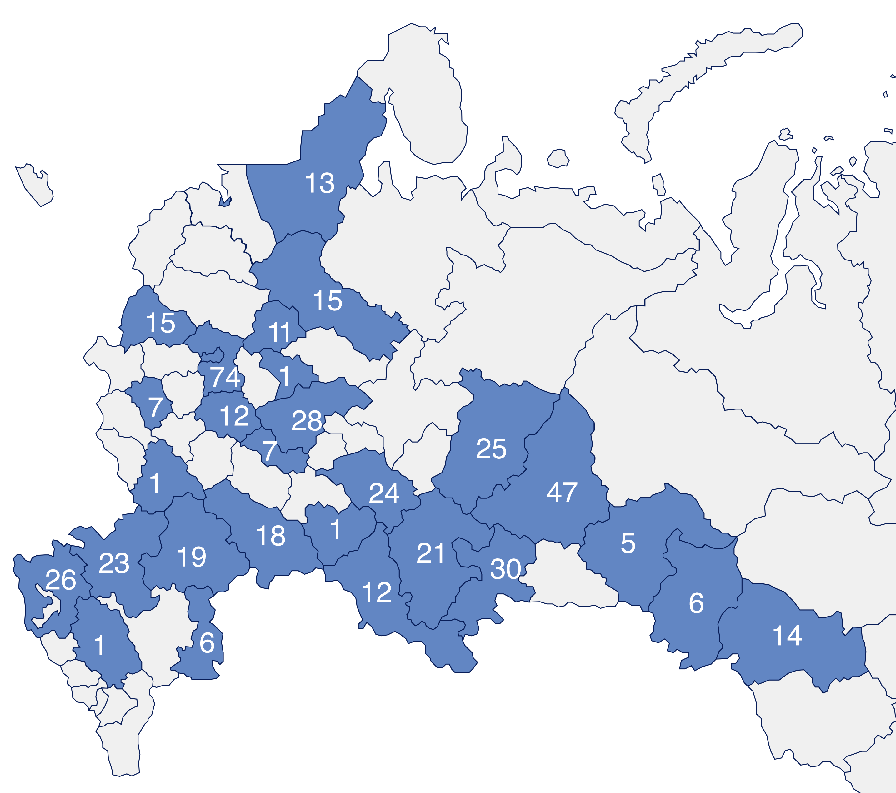

# Приложение А1: Влияние логарифма дохода на логарифм эффективной цены (робастность).
 Источник: расчеты авторов  

| Переменная    | Коэффициент  | Ст. ошибка |
|---------------|--------------|------------|
| Ср.подушевой доход    | 0.00510   | 0.00325   |
| Ср.заработная плата персонала    | 0.00662*    | 0.00315   |
| Количество торговых точек в регионе    | -0.00262*    | 0.00115   |
| Цена дизельного топлива    | -0.00346    | 0.02107   |
| Количество автомобилей на 1000 человек | 0.00956*    | 0.00439   |

**Число наблюдений:** 5 389 229  
**Adj.R²:** 0.935  

**Примечание.** Значимость коэффициентов: ***p < 0.001, **p < 0.01, *p < 0.05, *p < 0.1.  
Учтены фиксированные эффекты по товару, ритейлеру и неделе. Включены все контрольные переменные. Кластеризация стандартных ошибок по регионам. Все количественные переменные логарифмированы.

# Таблица А2: Влияние уровня бедности на логарифм **базовой цены:** модели по категориям для СЗТ и неСЗТ. Источник: расчеты авторов

| Категория    | Выборка  | Коэфф. | Ст. ошибка | Adj.R² | N |
|--------------|----------|---------|------------|-----------------|----|
| Безалк.напитки    | СЗТ    | −0.0009*    | 0.0004   | 0.962    | 66 089    |
|    | неСЗТ    | −0.0007*    | 0.0003   | 0.954    | 481 699    |
| Макароны, Крупы    | СЗТ    | −0.0008    | 0.0004   | 0.873    | 52 438    |
|    | неСЗТ    | 0.0001    | 0.0003   | 0.981    | 288 733    |
| Каши, мюсли, хлопья    | СЗТ    | −0.0047*    | 0.0020   | 0.935    | 1 057    |
|    | неСЗТ    | −0.0007    | 0.0004   | 0.968    | 151 258    |
| Чай, кофе, какао    | СЗТ    | −0.0014*    | 0.0006   | 0.973    | 41 880    |
|    | неСЗТ    | −0.0009*    | 0.0004   | 0.976    | 268 397    |
| Хлеб    | СЗТ    | −0.0131    | 0.0087   | 0.941    | 1 247    |
|    | неСЗТ    | 0.0009*    | 0.0003   | 0.969    | 152 923    |
| Молочные продукты    | СЗТ    | 0.0007    | 0.0007   | 0.967    | 57 029    |
|    | неСЗТ    | 0.0006    | 0.0003   | 0.983    | 642 690    |

**Примечание.** Значимость коэффициентов: ***p < 0.001, **p < 0.01, *p < 0.05. Во всех моделях учтены фиксированные эффекты по товару, ритейлеру и неделе. Включены все контрольные переменные. Кластеризация стандартных ошибок по регионам. Все количественные переменные, кроме бедности, логарифмированы. СЗТ — социально значимые товары; N — количество наблюдений.

  <strong>Рисунок 1: Число охваченных городов по регионам (2021–2022 гг.).</strong> 
  <em>Источник: расчеты автора</em> 
  

# Таблица А3: Средние социально-экономические показатели по регионам. Источник: расчеты авторов

| Регион | Income | Роverty, % | Wages | Cars | Competition | Diesel |
|--------|-----|--------|-------|------|------|------|
| Астраханская область | 33137.00 | 12.5 | 26262.33 | 300.37 | 6538.50 | 57.36 |
| Волгоградская область | 30286.23 | 10.32 | 30894.41 | 426.56 | 18084.55 | 54.95 |
| Вологодская область | 35707.20 | 11.03 | 30164.19 | 356.97 | 11431.94 | 59.04 |
| Воронежская область | 39114.82 | 7.23 | 30492.99 | 362.13 | 17341.78 | 53.30 |
| Ивановская область | 36509.00 | 10.20 | 27363.73 | 347.18 | 8689.75 | 55.97 |
| Краснодарский край | 45640.37 | 9.53 | 30062.38 | 305.25 | 71364.53 | 52.62 |
| Московская область | 55746.00 | 6.00 | 47571.07 | 323.09 | 63907.00 | 56.73 |
| Нижегородская область | 42280.75 | 7.84 | 22220.01 | 419.99 | 23896.28 | 54.25 |
| Новосибирская область | 40370.55 | 11.36 | 26494.95 | 345.25 | 19842.67 | 60.53 |
| Омская область | 36919.00 | 11.10 | 29498.51 | 275.66 | 11627.00 | 59.56 |
| Оренбургская область | 32972.00 | 11.60 | 25718.79 | 427.70 | 16867.50 | 57.74 |
| Орловская область | 35923.00 | 10.90 | 34001.51 | 350.32 | 6383.25 | 53.63 |
| Пермский край | 37353.91 | 11.36 | 30022.90 | 355.60 | 22353.70 | 59.16 |
| Республика Башкортостан | 34814.89 | 10.58 | 26758.10 | 386.62 | 34703.81 | 55.05 |
| Республика Карелия | 46019.00 | 11.10 | 27150.75 | 455.41 | 6955.42 | 61.64 |
| Республика Мордовия | 27439.00 | 14.10 | 38000.12 | 337.64 | 7293.75 | 55.80 |
| Республика Татарстан | 43622.09 | 5.44 | 27176.98 | 282.67 | 24371.06 | 53.25 |
| Ростовская область | 39764.27 | 10.64 | 26675.03 | 334.44 | 52647.94 | 54.20 |
| Самарская область | 35523.57 | 11.13 | 22940.10 | 319.09 | 26735.86 | 54.57 |
| Саратовская область | 29642.99 | 13.10 | 33923.93 | 331.38 | 21186.03 | 56.04 |
| Свердловская область | 44220.99 | 8.31 | 35460.13 | 436.34 | 30914.81 | 56.83 |
| Смоленская область | 35653.00 | 12.30 | 28946.99 | 263.90 | 8844.25 | 55.21 |
| Ставропольский край | 30100.00 | 11.20 | 25986.83 | 259.57 | 27879.50 | 56.07 |
| Тюменская область | 58951.00 | 12.50 | 45547.47 | 360.01 | 14734.64 | 57.72 |
| Челябинская область | 33546.06 | 11.03 | 38604.23 | 369.41 | 23225.77 | 56.60 |
| Ярославская область | 39003.07 | 8.24 | 31920.58 | 307.64 | 12626.42 | 55.12 |
| г. Москва | 94850.54 | 5.22 | 45206.56 | 285.25 | 64499.65 | 55.98 |
| г. Санкт-Петербург | 60700.85 | 4.89 | 43097.13 | 292.39 | 13643.05 | 56.72 |

**Примечание.** Income — среднедушевой доход по региону, руб.; Роverty — уровень бедности в регионе, %; Wages — средняя зарплата в розничной торговле, руб.; Cars — количество автомобилей на 1000 человек, шт.; Competition — число объектов розничной торговли, шт.; Diesel — средняя цена дизеля, руб./л.

**Таблица А4: Охват выборки по регионам: число городов, товарных позиций,  
ритейлеров и наблюдений.** *Источник: расчеты автора*

| Регион | Города, шт | Уник.товары, шт. | Ритейлеры, шт. | Наблюдения, шт |
|---|---|---|---|---|
| Респ. Татарстан | 2 | 5886 | 4 | 435 555 |
| Ростовская обл. | 2 | 5664 | 4 | 349 982 |
| Саратовская обл. | 2 | 5594 | 4 | 348 990 |
| г. Москва | 1 | 5844 | 3 | 330 745 |
| Тюменская обл. | 1 | 5931 | 3 | 318 402 |
| Нижегородская обл. | 1 | 5876 | 4 | 317 655 |
| Ярославская обл. | 1 | 5922 | 4 | 297 355 |
| г. Санкт-Петербург | 1 | 5557 | 3 | 291 088 |
| Самарская обл. | 1 | 5435 | 3 | 285 946 |
| Краснодарский край | 1 | 5369 | 3 | 279 557 |
| Свердловская обл. | 1 | 5412 | 3 | 253 321 |
| Новосибирская обл. | 1 | 5193 | 3 | 238 981 |
| Московская обл. | 14 | 5839 | 4 | 223 324 |
| Пермский край | 1 | 5291 | 3 | 217 848 |
| Воронежская обл. | 1 | 5268 | 3 | 205 031 |
| Респ. Башкортостан | 1 | 4984 | 3 | 195 955 |
| Челябинская обл. | 1 | 4786 | 3 | 176 075 |
| Вологодская обл. | 1 | 5493 | 3 | 162 694 |
| Орловская обл. | 1 | 4209 | 3 | 64 317 |
| Омская обл. | 1 | 4834 | 3 | 61 890 |
| Волгоградская обл. | 1 | 5304 | 3 | 60 758 |
| Ставропольский край | 1 | 3909 | 3 | 57 504 |
| Оренбургская обл. | 1 | 3718 | 3 | 53 539 |
| Ивановская обл. | 1 | 5941 | 5 | 49 795 |
| Смоленская обл. | 1 | 3863 | 3 | 34 898 |
| Респ. Мордовия | 1 | 3755 | 3 | 33 761 |
| Астраханская обл. | 1 | 3761 | 3 | 32 843 |
| Респ. Карелия | 1 | 5113 | 4 | 11 420 |

**Таблица А5: Влияние бедности на логарифм эффективной цены: модель с ошибками Driscoll–Kraay**  
*Источник: расчеты автора*

| Переменная | Оценка коэффициента | SE (Driscoll–Kraay) |
|---|---|---|
| Poverty | −0.00002 | 0.00017 |
| log(Wages) | 0.00931*** | 0.00199 |
| log(Competition) | −0.00176* | 0.00083 |
| log(Diesel) | 0.00422 | 0.01217 |
| log(Cars) | 0.00725** | 0.00262 |

- **Фиксированные эффекты:** Товар, Ритейлер, Неделя
- **Стандартные ошибки:** Driscoll–Kraay (лат = 2)
- **Число наблюдений:** 5 389 229
- **Adj.R²:** 0.935
- **RMSE:** 0.201

*Примечание: *p < 0.05***, **p < 0.01, ***p < 0.001

**Таблица А6: Влияние бедности на логарифм эффективной цены: модели по категориям для СЗТ и неСЗТ (ошибки Driscoll–Kraay).**  
*Источник: расчеты автора*

| Категория | Выборка | Коэфф. | SE | Adj.R² | N |
|:----------|:--------|-------:|:--:|:--------|--:|
| Молочные продукты | СЗТ | 0.0009** | 0.0003 | 0.945 | 57 029 |
| | неСЗТ | 0.0007*** | 0.0002 | 0.965 | 642 690 |
| Рыба/Морепродукты | СЗТ | 0.0018 | 0.0061 | 0.821 | 643 |
| | неСЗТ | 0.0014*** | 0.0003 | 0.933 | 263 521 |
| Безалкогольные напитки | СЗТ | –0.0007* | 0.0004 | 0.902 | 66 089 |
| | неСЗТ | –0.0006** | 0.0002 | 0.913 | 481 699 |
| Приправы/Соусы | СЗТ | –0.0012 | 0.0010 | 0.940 | 17 208 |
| | неСЗТ | –0.0009*** | 0.0002 | 0.928 | 711 053 |
| Хлебобулочные изделия | СЗТ | 0.0133** | 0.0047 | 0.899 | 1 247 |
| | неСЗТ | 0.0011*** | 0.0003 | 0.936 | 152 923 |
| Чай/Кофе/Какао | СЗТ | –0.0005 | 0.0004 | 0.928 | 41 880 |
| | неСЗТ | –0.0010** | 0.0003 | 0.925 | 268 397 |
| Каши/Мюсли/Хлопья | СЗТ | –0.0045** | 0.0014 | 0.842 | 1 057 |
| | неСЗТ | –0.0010** | 0.0003 | 0.926 | 151 258 |
| Заморозка/Готовая еда | СЗТ | –0.0032*** | 0.0007 | 0.938 | 15 757 |
| | неСЗТ | 0.0012*** | 0.0003 | 0.915 | 301 550 |

*Примечание: *p < 0.05, **p < 0.01, ***p < 0.001*

**Таблица А7: Сравнение влияния логарифма дохода и бедности на логарифм эффективной цены: модели по ритейлерам с Driscoll–Kraay стандартными ошибками.**  
*Источник: расчеты автора*

| Ритейлер | Переменная | Коэфф. | SE | Adj. R² | N |
|:---------|:------------|-------:|:--:|:--------|--:|
| Lenta | log(Income) | −0.0047* | 0.0023 | 0.9509 | 3 277 798 |
| | Poverty | 0.0007** | 0.0001 | 0.9509 | 3 277 798 |
| Magnit | log(Income) | 0.0107** | 0.0032 | 0.9255 | 399 315 |
| | Poverty | −0.0011** | 0.0003 | 0.9255 | 399 315 |
| Pyaterochka | log(Income) | 0.0186** | 0.0042 | 0.9372 | 1 102 003 |
| | Poverty | −0.0007* | 0.0003 | 0.9372 | 1 102 003 |
| Auchan | log(Income) | 0.2041** | 0.0573 | 0.9586 | 270 822 |
| | Poverty | 0.0151 | 0.0175 | 0.9585 | 270 822 |
| Perekrestok | log(Income) | 0.0578** | 0.0180 | 0.9429 | 339 291 |
| | Poverty | −0.0045** | 0.0009 | 0.9429 | 339 291 |

*Примечание: *p < 0.05, **p < 0.01, ***p < 0.001*
